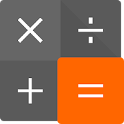

<h1 align="center">Proyecto Calculadora</h1>
 
 
 
 

  
<h1 align="center">🚀 Comenzando 🚀</h1>

Esta app calculadora te permite hacer cálculos matemáticos, en esta versión "Tarea 7"  están disponibles las operaciones de sumar, restar, multiplicar, dividir y de resto.
 

<h1 align="center">🛠️ Construido con 🛠️</h1>

Java - Lenguaje de programación
 

IntellJ - IDE
 

Maven - Manejador de dependencias
 

<h1 align="center">✒️ Autores ✒️</h1>

Alejandro Cea
 

<h1 align="center">📄 Licencia 📄</h1>

Este proyecto está bajo la Licencia Open-Source
 
